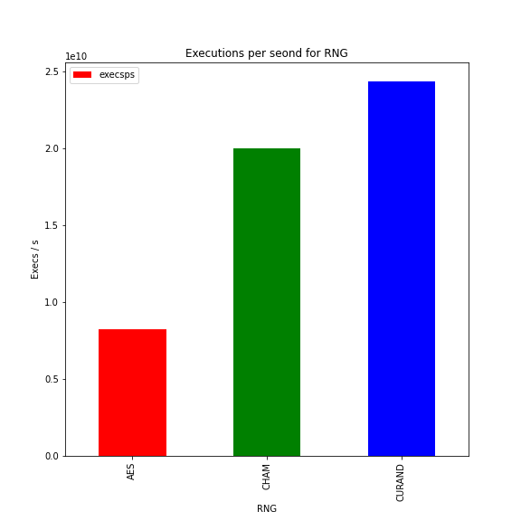

# GPU accelerated SMT constraint solving with LibFuzzer

> By John Cunniff, Nobel Gautam, & Professor Brendan Dollan-Gavitt

## Overview

By applying traditional fuzzing techniques, we achieved high throughput SMT constraint solving.

SMT solvers typically apply very complicated algorithms to determine if a set of constraints is satisfiable (and produce a solution). The approach that we have taken is to abandon these fancy methods and try to throw random data at the formula over many many thousands of threads. This is essentially what fuzzing is: we throw random data at a function in an attempt to find a crash. Instead of a crash, here we try to find a solution to the SMT formula.

By choosing to brute force the SMT solution, the problem quickly becomes: how do we maximize throughput?

## The process

### GPU acceleration

GPUs offer the ability to spin up many thousands of threads each doing pure computation. To understand how we took advantage of CUDA, we first need to talk at a very high level about how GPUs work. When you run a program on a GPU, it is essentially running on a completely separate computer. The program running on the GPU is called the kernel. Even though both the host program and CUDA kernel can be defined in the same files, there are several caveats to managing input and output. If you want to cross the boundary between the two, for example to retrieve GPU data to CPU, you must use the provided cudaMemcpy function to move the buffer from device (GPU) memory to host (CPU) memory.

With CUDA programming we need to add annotations to variables and functions to annotate if they are to be run on host or on the GPU. Anywhere you see `__host__` means that that variable / function is a host function. Where you see `__device__` that implies the variable / function is meant for the GPU. These annotations define the boundaries between the host program and CUDA kernel. If you are in a `__device__` function on  the GPU, you won’t be able to access anything annotated with `__host__` and vice versa.


### SMTLib

We have slightly modified the [JFS SMT constraint solver](https://github.com/mc-imperial/jfs) to run on a CUDA capable GPU. For the most part this modification was simply changing the `.cpp` extensions to `.cu` and adding `__device__` to things. Using this library, we can generate libfuzzer `LLVMFuzzerTestOneInput` functions from SMT theories. For example, the following SMT formula

```
(set-info :smt-lib-version 2.6)
(set-logic QF_FP)
(declare-fun x () Float32)
(define-fun f1 () Float32 ((_ to_fp 8 24) #x3f800000))
(assert (fp.eq x f1))
(check-sat)
(exit)
```

Becomes...

```c++
#include "theory.h"
__device__ int LLVMFuzzerTestOneInput(const uint8_t *data, size_t size) {
  BufferRef<const uint8_t> jfs_buffer_ref = BufferRef<const uint8_t>(data, size);
  const Float<8, 24> x = makeFloatFrom<8, 24>(jfs_buffer_ref, 0, 31);
  uint64_t jfs_num_const_sat = 0;
  const BitVector<1> jfs_ssa_0 = BitVector<1>(UINT64_C(0));
  const BitVector<8> jfs_ssa_1 = BitVector<8>(UINT64_C(127));
  const BitVector<23> jfs_ssa_2 = BitVector<23>(UINT64_C(0));
  const Float<8, 24> jfs_ssa_3 = Float<8, 24>(jfs_ssa_0, jfs_ssa_1, jfs_ssa_2);
  const bool jfs_ssa_4 = x.ieeeEquals(jfs_ssa_3);
  if (jfs_ssa_4) {
	++jfs_num_const_sat;
  }
  if (jfs_num_const_sat == 1) {
	// Fuzzing target
	return 1;
  } else {
	return 0;
  }
}
// End program
int varsize = 4;
```

Notice the `__device__` annotation next to `LLVMFuzzerTestOneInput`. That lets CUDA know that that function should be run on the GPU rather than the host. Each of our GPU threads will call the `LLVMFuzzerTestOneInput` function in a loop.

### Fuzzing

Our approach to fuzzing the SMTs is relatively simple. We choose some random number generator to generate input, then throw it at the SMT formulas. There is no feedback or corpus system for potentially improving the quality of input. This is called “blind” fuzzing. 

We did not have an opportunity to test coverage guided fuzzing. We would expect that it would significantly reduce the throughput we currently achieve. Whether the increased efficiency of fuzzing outweighs the reduced throughput, we can’t say. This is to say nothing of the complexity of implementing such systems in a multi GPU setup.

### Random Number Generation

We tested several methods of random number generation: reduced round AES (specifically, two rounds), CHAM, and cuRAND. As we don’t require a cryptographically secure pseudorandom number generator, we can get away with using encryption algorithms like AES and CHAM. The structure of our fuzzing loop varied depending on which number generator we were using.

The way we used AES and CHAM were quite simple. We initialize a buffer from `urandom` with a segment assigned to each thread. We then cudaMemcpy this buffer onto the GPU. In our fuzzing loop, we encrypt the segment of the buffer then throw it at `LLVMFuzzerTestOneInput`. The urandom initialization is an extra step in the host process before launching the CUDA kernel. Beyond initialization, it is important that all random number generation occurs on the GPU.





cuRAND is a library for random number generation with support for generating random numbers on the GPU and storing them in GPU memory. There was no extra initialization step on host before launching the CUDA kernel.



### A word on heat

As with pretty much any computationally intensive process, heat is the enemy. When we run our fuzzer, we use very little VRAM, but maintain 100% core utilization while running. There is no IO to slow things down. Every thread just moves from one computation to the next.

We initially were using a single K80 to test on. As it turns out, when a K80 die temperature is 100C it shuts off and won’t be usable until you fully reboot the machine. We needed to rework the entire cooling solution of this one server we worked on to specifically handle the heat from the GPU.

In later tests we used a dual RTX 3090 machine. In this setup, thermal throttling was the only real issue.

## Results

The name of the game here is speed. The most optimal configuration is that which maximizes executions per second. That is how many times can we run our fuzz loop in a second over all threads. We created some simple benchmarks where we run the fuzzer with some set number of iterations of the fuzzing loop in each thread for each of the random number generators we used. Since we always launch the same number of threads, and run the loop the same number of times each, we have a set number of computations per run.

Over 750 runs of each number generator on the dual 3090 machine, we can see that cuRAND (24 billion execs/second) is a bit faster than CHAM (20 billion execs/second), with AES (8 billion execs/second) being significantly slower than both.



Another way to view this would be the amount of time it takes


